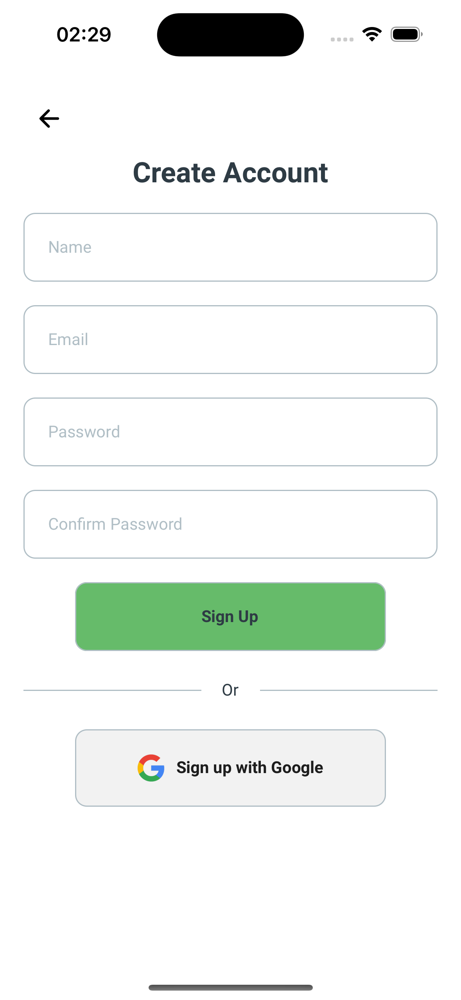
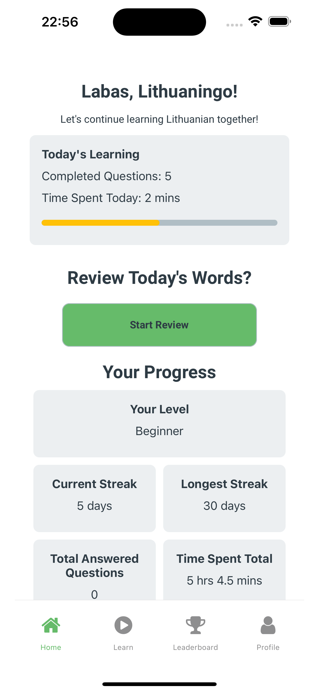
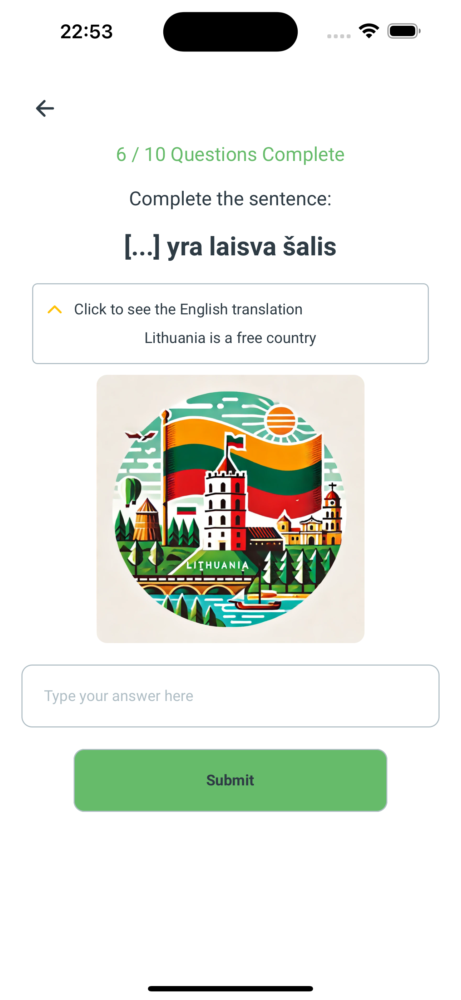

# Lithuaningo

Welcome to **Lithuaningo**! A mobile application designed to help you master the Lithuanian language through engaging and interactive methods.

## Features

- **User Authentication**: Secure login via Email and Google Sign-In.
- **Interactive Learning Modules**: Multiple-choice and fill-in-the-blank exercises.
- **Progress Tracking**: Detailed statistics to monitor your learning journey.
- **User Profile Management**: Customize and manage your personal details.
- **Leaderboard**: Track and compare your progress with other users.

## Screenshots

<p align="center">
  
  
  
  
</p>

## Installation

Follow these steps to get started with Lithuaningo:

1. **Clone the repository**:

   ```bash
   git clone https://github.com/yourusername/lithuaningo.git
   cd lithuaningo
   ```

2. **Install dependencies**:

   ```bash
   npm install
   ```

3. **Set up environment variables**:
   Create a `.env` file in the root directory and add the following:

   ```env
   EXPO_PUBLIC_GOOGLE_WEB_CLIENT_ID=your-google-web-client-id
   EXPO_PUBLIC_EAS_PROJECT_ID=your-eas-project-id
   ```

4. **Run the project**:
   ```bash
   npm start
   ```

## Usage

Use the following commands to interact with the project:

- **Start the development server**:

  ```bash
  npm start
  ```

- **Run on an Android device or emulator**:

  ```bash
  npm run android
  ```

- **Run on an iOS device or simulator**:

  ```bash
  npm run ios
  ```

- **Run the web version**:
  ```bash
  npm run web
  ```

## Contributing

We welcome contributions! Please follow these steps:

1. Fork the repository.
2. Create a new branch (`git checkout -b feature-branch`).
3. Make your changes.
4. Commit your changes (`git commit -m 'Add new feature'`).
5. Push to the branch (`git push origin feature-branch`).
6. Open a pull request.

## License

This project is licensed under the MIT License. See the [LICENSE](LICENSE) file for details.

## Contact

For inquiries, please contact us at [lithuaningo@gmail.com](mailto:lithuaningo@gmail.com).

---

Happy learning with Lithuaningo!
